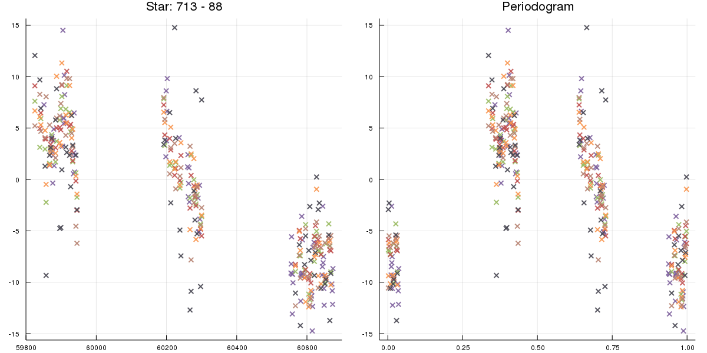
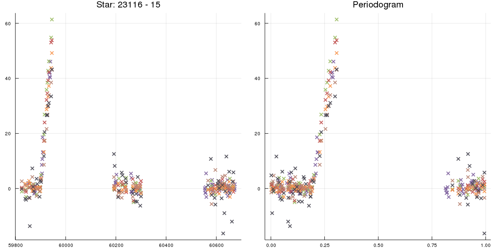
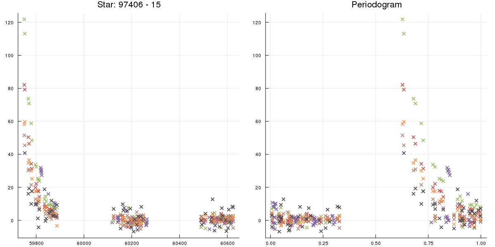
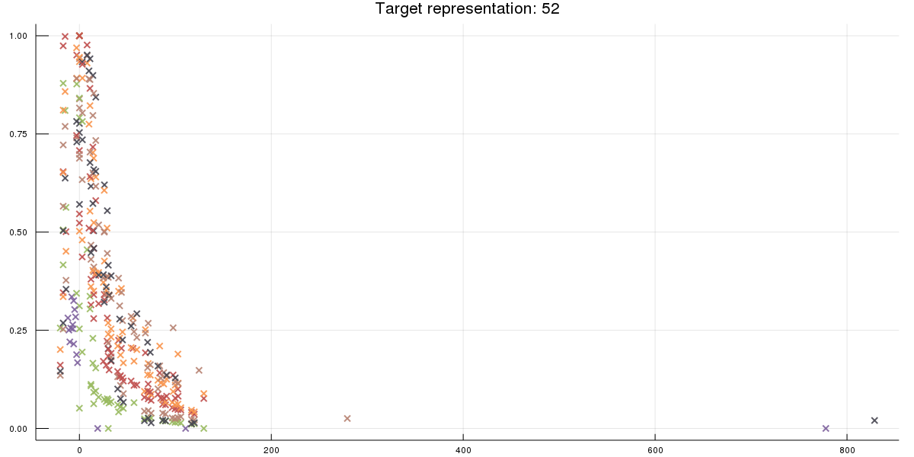
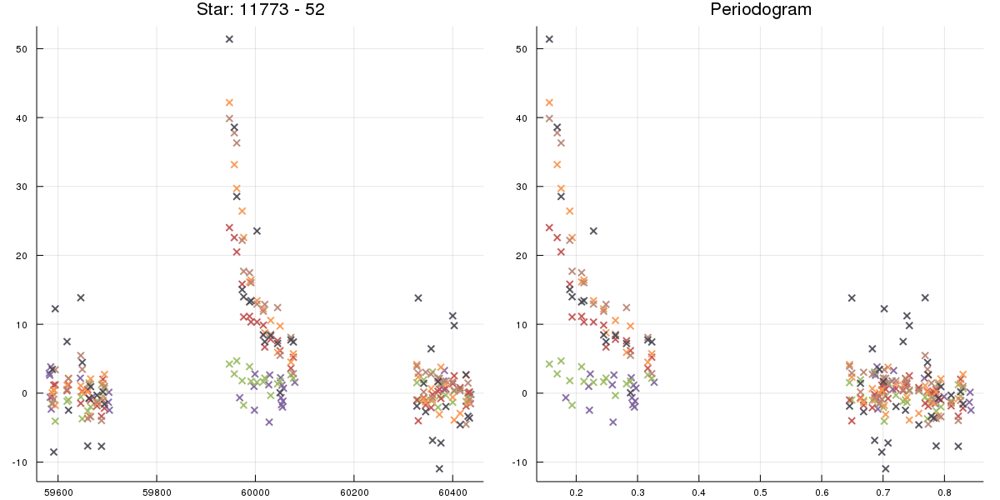
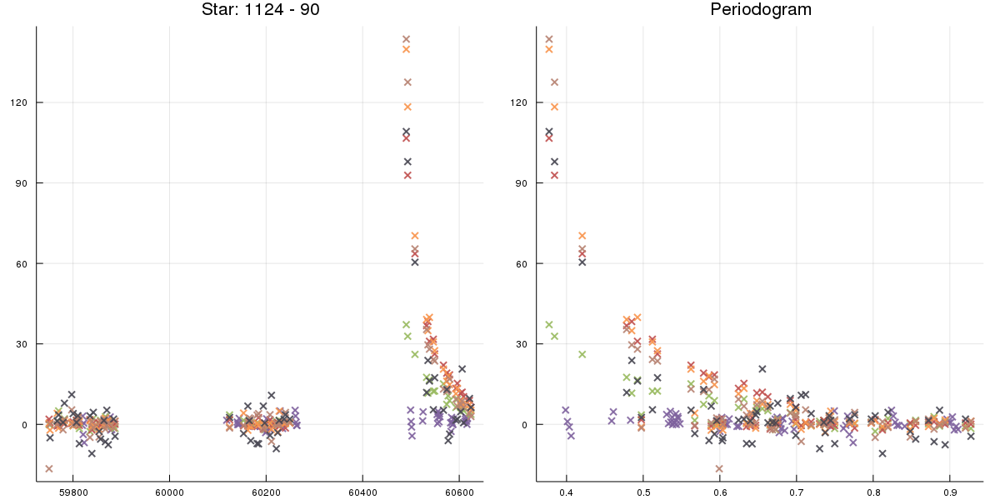

# Plasticc - Version 2

<style type="text/css">
	img[alt=plot] { height: 100px !important; }
</style>


## Summary
1. [Class Mapping](#class-Mapping)
2. [Data analysis](#data-analysis)
    1. [Intra galactic](#intra-galactic)
        * [Class 6](#class-6)
        * [Class 92](#class-92)
        * [Class 16](#class-16)
        * [Class 53](#class-53)
        * [Class 65](#class-65)
    2. [Extra galactic](#extra-galactic)
        * [Class 64](#class-64)
        * [Class 88](#class-88)
        * [Class 15](#class-15)
        * [Class 42](#class-42)
        * [Class 52](#class-52)
        * [Class 62](#class-62)
        * [Class 67](#class-67)
        * [Class 90](#class-90)
        * [Class 95](#class-95)
3. [Features](#Features)
    1. [Intra galactic](#intra-galactic-feature)
    2. [Deep survey](#deep-survey)
    3. [Periodogram](#periodogram)
    4. [Outliers (using MAD)](#mad-outliers)
    5. [Light bands ratios](#light-bands-ratios)
    6. [Rises detection](#rises-detection)
    7. [Descents detection](#descents-detection)

## Data analysis
### Intra galactic
#### Class 6
Non periodic but symmetric light curves


#### Class 92
Periodic bands (need periodogram): looks like a sinusoid


#### Class 16
A lot of points are near 0, some of them are below zero. All the light bands move at the same time


#### Class 53
Periodic bands (but not regular as class 92)


#### Class 65
Very stable bands with very high points (use median absolute deviation to detect outliers)


### Extra galactic
#### Class 64
Looks like class 64 but it's extra galactic


#### Class 88
No periodic, very noisy. Almost all points are not at zero.





#### Class 15
A lot of points are near 0 but they are rise/descent
Use the ratio between the light bands.






#### Class 42
Same as 15.


#### Class 52
Same as 15.
Red bands seems to be lower (check the real bands mapping)







#### Class 62
Fast rise/descent


#### Class 67
Fast rise/descent


#### Class 90
Looks more bright than the others (confirm this hypothesis)





#### Class 95
Strong rise (more triangular shape)
The light bands don't reach their max at the same time.


## Features
1. [Intra galactic](#intra-galactic-feature)
2. [Deep survey](#deep-survey)
3. [Periodogram](#periodogram)
4. [Outliers (using MAD)](#mad-outliers)
5. [Light bands ratios](#light-bands-ratios)
6. [Rises detection](#rises-detection)
7. [Descents detection](#descents-detection)

**Achievements** :
- [x] Intra galactic
- [x] Deep survey
- [ ] Periodogram
- [ ] MAD Outliers
- [ ] Light bands ratios
- [ ] Rises detection
- [ ] Descents detection

### Intra galactic feature

#### Selected features
```julia
intra_galactic = star.photoz == 0.0
# extra_galactic == intra_galactic is False
```

### Deep survey
#### Property computation
```julia
ddf = star.ddf == true
```

### Periodogram
#### Property computation
#### Selected features


### MAD Outliers
#### Property computation
#### Selected features

### Light bands ratios
#### Property computation
#### Selected features

### Rises detection
#### Property computation
#### Selected features

### Descents detection
#### Property computation
#### Selected features