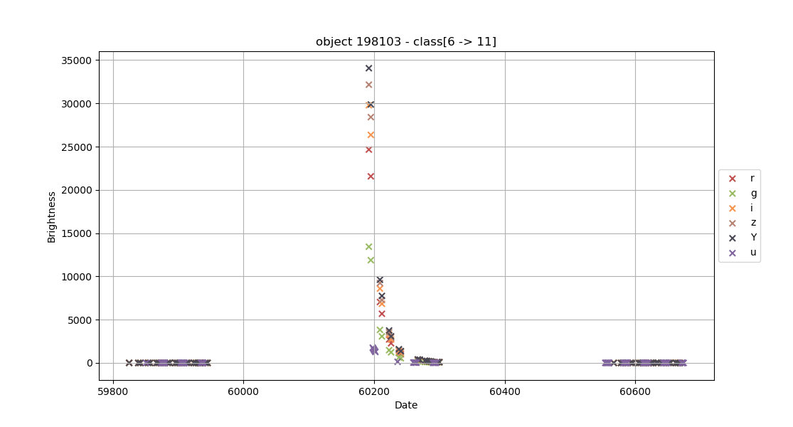
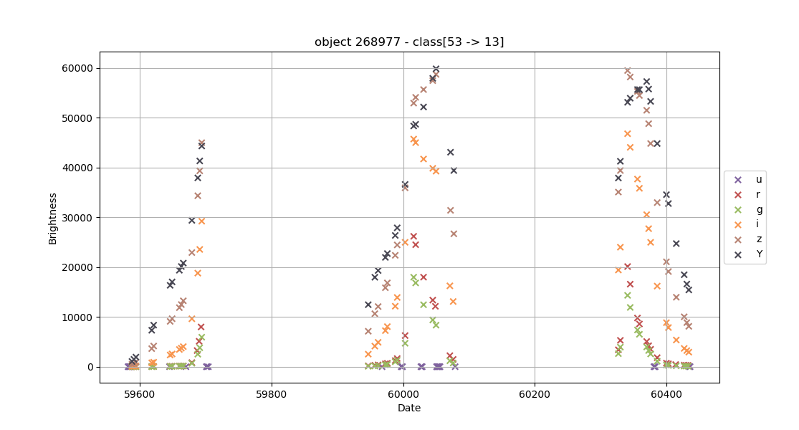
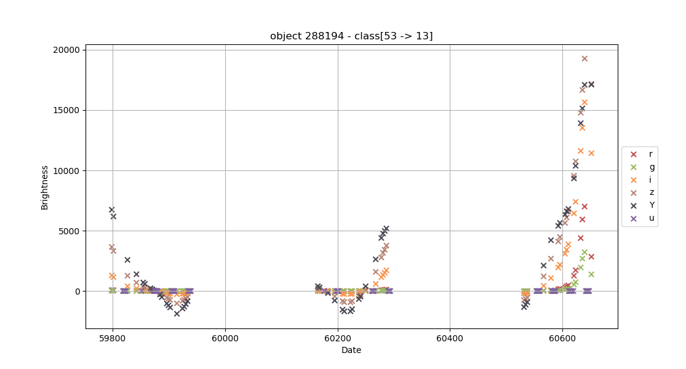
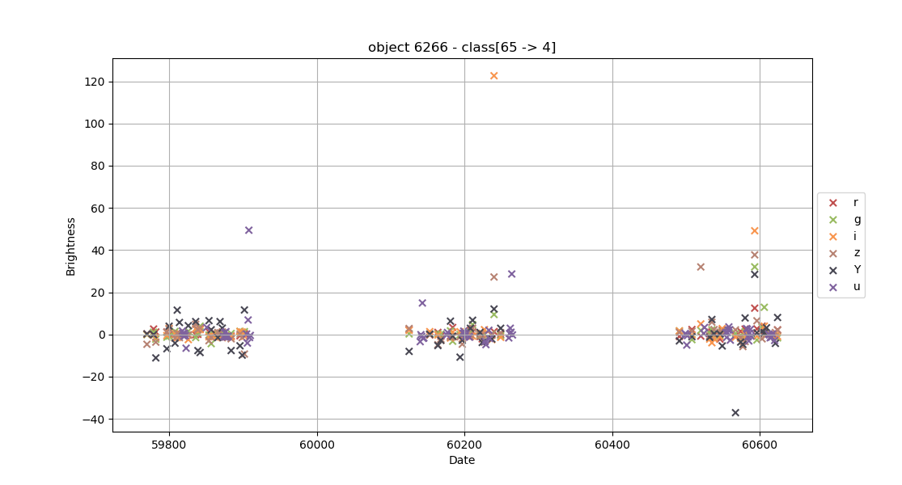
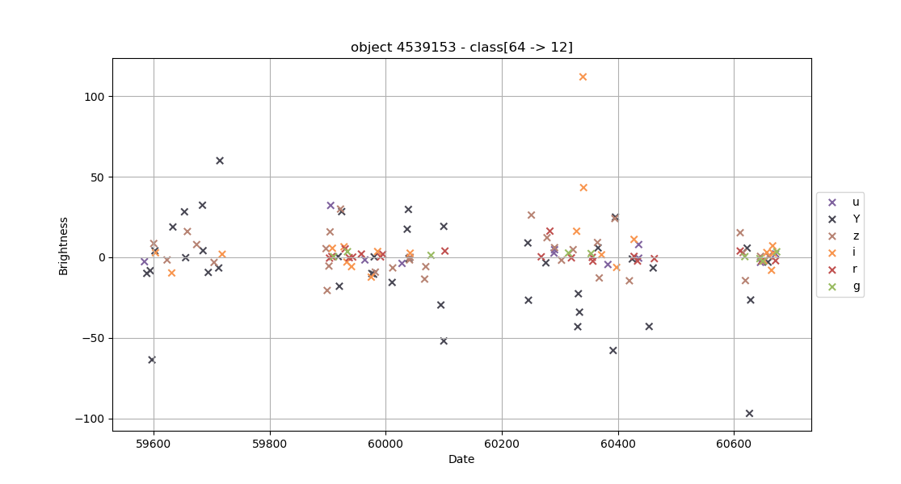
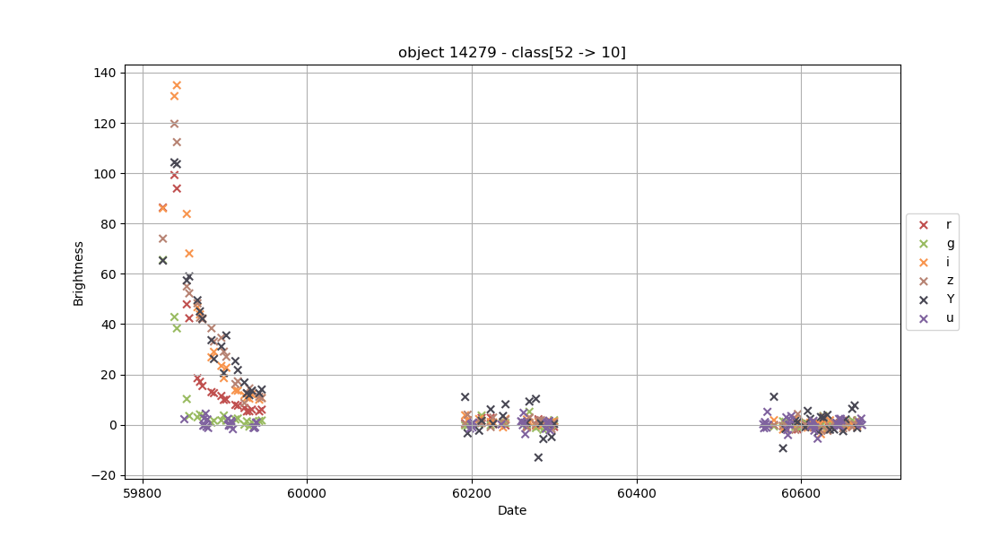
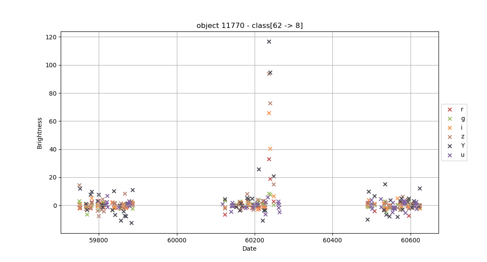
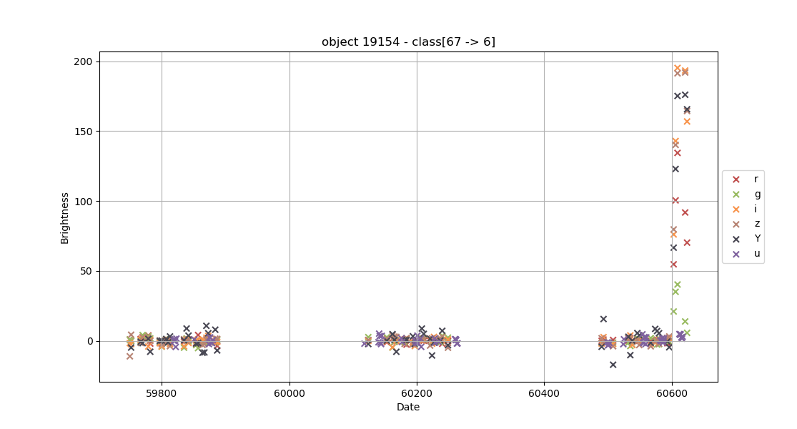

# Plasticc - Version 2

<span class="notice">
The classes are mapped to an integer. We are using the convention [real_class -> mapped_integer] in our graphics. If
some of the two values is missing (ex: class[xx -> 11]) please refer you to the chapter Class Mapping.
</span>

## Summary
1. [Class Mapping](#class-Mapping)
2. [Data analysis](#data-analysis)
    1. [Intra galactic](#intra-galactic)
        * [Class 6 -> 11](#class-6_11)
        * [Class 92 -> 0](#class-92_0)
        * [Class 16 -> 5](#class-16_5)
        * [Class 53 -> 13](#class-53_13)
        * [Class 65 -> 4](#class-65_4)
    2. [Extra galactic](#extra-galactic)
        * [Class 64 -> 12](#class-64_12)
        * [Class 88 -> 1](#class-88_1)
        * [Class 15 -> 9](#class-15_9)
        * [Class 42 -> 2](#class-42_2)
        * [Class 52 -> 10](#class-52_10)
        * [Class 62 -> 8](#class-62_8)
        * [Class 67 -> 6](#class-67_6)
        * [Class 90 -> 3](#class-90_3)
        * [Class 95 -> 7](#class-95_7)
3. [Features](#Features)
    1. [Intra galactic](#intra-galactic-feature)
    2. [Deep survey](#deep-survey)
    3. [Periodogram](#periodogram)
    4. [Outliers (using MAD)](#mad-outliers)
    5. [Light bands ratios](#light-bands-ratios)
    6. [Rises detection](#rises-detection)
    7. [Descents detection](#descents-detection)
    
## Class Mapping
- 92 -> 0
- 88 -> 1
- 42 -> 2
- 90 -> 3
- 65 -> 4
- 16 -> 5
- 67 -> 6
- 95 -> 7
- 62 -> 8
- 15 -> 9
- 52 -> 10
- 6 -> 11
- 64 -> 12
- 53 -> 13
- unknown_class -> 14

## Data analysis
### Intra galactic
#### Class 6_11
Non periodic but symmetric light curves





#### Class 92_0
Periodic bands (need periodogram): looks like a sinusoid


#### Class 16_5
A lot of points are near 0, some of them are below zero. All the light bands move at the same time


#### Class 53_13
Periodic bands (but not regular as class 92 -> 0)







#### Class 65_4
Very stable bands with very high points (use median absolute deviation to detect outliers)





### Extra galactic
#### Class 64_12
Looks like class 64 -> 4 but it's extra galactic





#### Class 88_1
No periodic, very noisy. Almost all points are not at zero.


#### Class 15_9
A lot of points are near 0 but they are rise/descent
Use the ratio between the light bands.


#### Class 42_2
Same as 15 -> 9.


#### Class 52_10
Same as 15 -> 9.
Red bands seems to be lower (check the real bands mapping)





#### Class 62_8
Fast rise/descent





#### Class 67_6
Fast rise/descent





#### Class 90_3
Looks more bright than the others (confirm this hypothesis)


#### Class 95_7
Strong rise (more triangular shape)
The light bands don't reach their max at the same time.


## Features
1. [Intra galactic](#intra-galactic-feature)
2. [Deep survey](#deep-survey)
3. [Periodogram](#periodogram)
4. [Outliers (using MAD)](#mad-outliers)
5. [Light bands ratios](#light-bands-ratios)
6. [Rises detection](#rises-detection)
7. [Descents detection](#descents-detection)

**Achievements** :
- [x] Intra galactic
- [x] Deep survey
- [ ] Periodogram
- [ ] MAD Outliers
- [ ] Light bands ratios
- [ ] Rises detection
- [ ] Descents detection
 
### Intra galactic feature
#### Property computation
```python
PHOTOZ = Property('photoz', lambda meta: meta.photoz)
```

#### Selected features
```python
intra_galactic = PHOTOZ == 0.0
# extra_galactic == intra_galactic is False
```

### Deep survey
#### Property computation
```python
DDF = Property('DDF', lambda meta: meta.ddf)
```

#### Selected features
```python
deep_survey = DDF == True
# Wide survey == deep_survey is False
```

### Periodogram
#### Property computation
#### Selected features


### MAD Outliers
#### Property computation
#### Selected features

### Light bands ratios
#### Property computation
#### Selected features

### Rises detection
#### Property computation
#### Selected features

### Descents detection
#### Property computation
#### Selected features